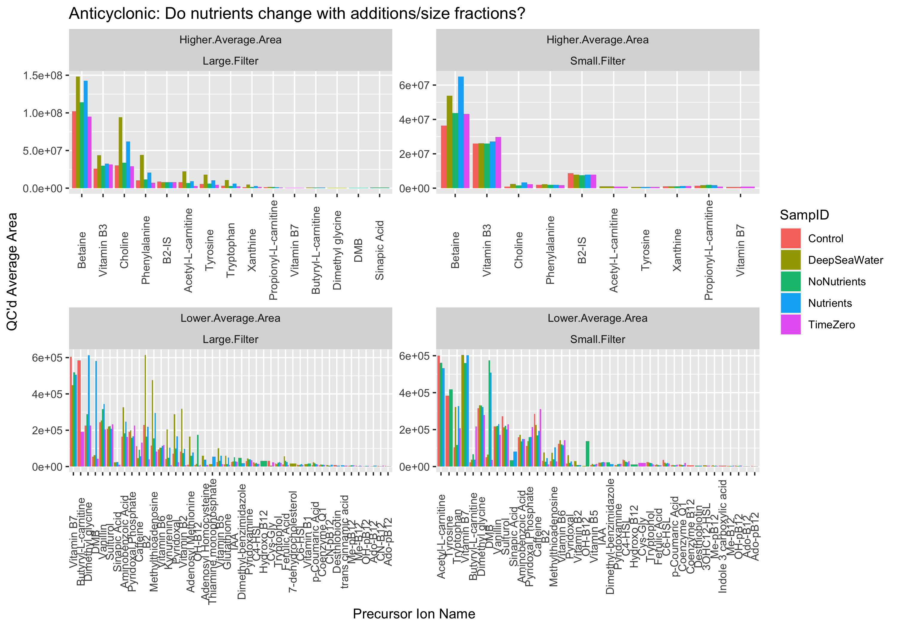

```{r setup, include=FALSE}
library(kableExtra)
library(knitr)
library(tidyverse)
knitr::opts_chunk$set(echo = TRUE)
```

### Final summary of the MESOSCOPE B12 Cyano Vitamins combined with overall Cyano MESOSCOPE project.

#### QC threshold is lowered to 1500 for vitamins, compared with ordinary 5000 level

- NUTRIENTS: [DMBnoB12, noB12], both containing a f/2 spike 
- NONUTRIENTS: [WB12, WDMB], no additional nutrients added 
- DEEPSEAWATER: [DSW], 10% Deep Sea Water (DSW) taken from 700 m, filtered and evenly mixed with 90% in situ water from 25 m 
- TIME 0: [T0] In situ condition at the start of the experiment, aka time 0 
- CONTROL: [Control], 100% in situ water from 25 m, incubated and then filtered 

---

#### QE + TQS QC parameters

The area QC conditions were modified to reflect the Vitamins run, from 5000 min to 1500 min.
The overall Cyano run was QC'd using the normal 5000 cutoff.

* **area.min   <- 1500** for vitamins
* **area.min   <- 5000** for Cyano run

---

##### Combine all relevant datasets (Vitamins 1500, Full Cyano B12 Incubations set), and calculate triplicate averages. Remove DMB and B2-IS from the averages calculations in the Vitamins set (to avoid inflated values from added DMB)
```{r sample table, echo=FALSE}
Complete.Dataset <- read.csv("data_processed/Vitamins_Incubations_CompleteDataset.csv")
Complete.Dataset.Avg <- read.csv("data_processed/Vitamins_Incubations_AvgCompleteDataset.csv")
```

### Questions
### Which compounds exist in which size fraction?

How many of the samples show up in each size fraction? 

```{r Which Compounds, include=FALSE}
Standards <- read.csv("https://raw.githubusercontent.com/IngallsLabUW/Ingalls_Standards/master/Ingalls_Lab_Standards_NEW.csv",
                               stringsAsFactors = FALSE, header = TRUE) %>%
  select(Compound.Name_old, Compound.Type) %>%
  rename(Precursor.Ion.Name = Compound.Name_old)

Which.AA.df <- Complete.Dataset %>%
  mutate(Precursor.Ion.Name = as.character(Precursor.Ion.Name)) %>%
  left_join(Standards) %>%
  filter(Compound.Type == "Amino Acid") %>%
  group_by(Precursor.Ion.Name, Size.Fraction) %>%
  mutate(
    Number.Of.Samples = n(),
    Number.Missing = sum(is.na(Area.with.QC)),
    Percent.Present = 1 - (sum(is.na(Area.with.QC))/Number.Of.Samples),
    Over.Half.Missing = ifelse(Percent.Present >= 0.5, FALSE, TRUE)
  ) %>%
  ungroup()

which.AA <- ggplot(Which.AA.df, aes(x = reorder(Precursor.Ion.Name, -Percent.Present),
                        y = Percent.Present)) +
  facet_wrap(~Size.Fraction + Eddy) +
  geom_bar(position = "dodge", stat = "identity") +
  scale_fill_discrete(guide = "none") +
  theme(axis.text.x = element_text(angle = 90, vjust = 0.25)) +
  scale_x_discrete(name ="Precursor.Ion.Name") +
  scale_y_continuous(name = "Percent of Samples Present in Dataset") 
ggsave("figures/Which.AA.png", width = 9, height = 7)

Which.Cmpds.df <- Complete.Dataset %>%
  group_by(Precursor.Ion.Name, Size.Fraction) %>%
  mutate(
    Number.Of.Samples = n(),
    Number.Missing = sum(is.na(Area.with.QC)),
    Percent.Present = 1 - (sum(is.na(Area.with.QC))/Number.Of.Samples),
    Over.Half.Missing = ifelse(Percent.Present >= 0.5, FALSE, TRUE)
  ) %>%
  ungroup()

which.compounds <- ggplot(Which.Cmpds.df, aes(x = reorder(Precursor.Ion.Name, -Percent.Present),
                        y = Percent.Present)) +
  facet_wrap(~Size.Fraction + Eddy) +
  geom_bar(position = "dodge", stat = "identity") +
  scale_fill_discrete(guide = "none") +
  theme(axis.text.x = element_text(angle = 90, vjust = 0.25)) +
  scale_x_discrete(name ="Precursor.Ion.Name") +
  scale_y_continuous(name = "Percent of Samples Present in Dataset") 
ggsave("figures/Which.Cmpds.png", width = 9, height = 7)
```


### Which amino acids exist in which size fraction?


### Which compounds were *completely* in one or the other size fraction?
```{r, include=FALSE}
WhichCompounds <- function(df, EddyDirection) {
  Table.DF <- df %>%
    filter(Eddy == EddyDirection) %>%
    group_by(Precursor.Ion.Name) %>%
    mutate(Number.Of.Samples = n(),
           Number.Missing = sum(is.na(Area.with.QC.mean))) %>%
    filter(Number.Of.Samples != Number.Missing) %>%
    group_by(Precursor.Ion.Name, Size.Fraction) %>%
    mutate(Is.Present = ifelse(is.na(Area.with.QC.mean), TRUE, FALSE)) %>%
    group_by(Precursor.Ion.Name, Size.Fraction) %>%
    mutate(Group.Present = ifelse(any(Is.Present == FALSE), TRUE, FALSE)) %>%
    ungroup() %>%
    group_by(Precursor.Ion.Name) %>%
    mutate(Filter.Check = ifelse(any(Group.Present == FALSE), TRUE, FALSE)) %>%
    filter(Filter.Check == TRUE) %>%
    filter(Group.Present == TRUE) %>%
    select(Precursor.Ion.Name, Size.Fraction, Eddy) %>%
    unique()
  return(Table.DF)
}

Table.DF.Cyclonic <- WhichCompounds(Complete.Dataset.Avg, "Cyclonic")
Table.DF.Anticyclonic <- WhichCompounds(Complete.Dataset.Avg, "Anticyclonic")
```

```{r, include=TRUE}
Table.DF.Cyclonic %>%
  kable(booktabs = T)
Table.DF.Anticyclonic %>% 
  kable(booktabs = T) %>%
  row_spec(which(Table.DF.Anticyclonic$Size.Fraction == "Small.Filter"), color = "red")
```


## Which compounds have 100% of the samples present, versus those that have no samples present?
Remember that this is *after QC*, but before averaging and DMB/B2-IS removal.

```{r Which Compounds table, echo=FALSE}

AllSamplesPresent <- function(df, EddyDirection) {
  samples.present <- df %>%
    filter(Eddy == EddyDirection) %>%
    group_by(Precursor.Ion.Name) %>%
    mutate(Count = n(),
           Missing = sum(is.na(Area.with.QC))) %>%
    filter(Missing == 0) %>%
    select(Precursor.Ion.Name) %>%
    unique()
  
  return(samples.present)
}

WhichCompoundsTableCyc <- AllSamplesPresent(Complete.Dataset, "Cyclonic")
WhichCompoundsTableAntiCyc <- AllSamplesPresent(Complete.Dataset, "Anticyclonic")

kable(WhichCompoundsTableCyc, caption = "Cyclonic")
kable(WhichCompoundsTableAntiCyc, caption = "Anticyclonic")
```


### Do nutrients change with additions/size fractions?
```{r, include=FALSE}
Nutrient.Change <- Complete.Dataset.Avg %>%
  filter(Eddy == "Anticyclonic") %>%
  select(Precursor.Ion.Name, Area.with.QC.mean, Binned.Group, Size.Fraction, Eddy, Dataset) %>%
  unique() %>%
  mutate(SampID = str_extract(Binned.Group, "[^_]+")) %>%
  filter(!is.na(Area.with.QC.mean)) %>%
  mutate(Area.with.QC.mean = as.numeric(Area.with.QC.mean)) %>%
  mutate(Dataset.Position = ifelse(Area.with.QC.mean > 633000,
                                   "Higher.Average.Area", "Lower.Average.Area")) %>%
  arrange(desc(Area.with.QC.mean)) 

nutrient.change.plot <- ggplot(Nutrient.Change, aes(x = reorder(Precursor.Ion.Name, -Area.with.QC.mean),
                            y = Area.with.QC.mean, fill = SampID)) +
  geom_bar(position = "dodge", stat = "identity") +
  facet_wrap(~Dataset.Position + Size.Fraction, scales = "free") +
  theme(axis.text.x = element_text(angle = 90, vjust = 0.5)) +
  scale_y_continuous("QC'd Average Area") +
  scale_x_discrete("Precursor Ion Name") +
  ggtitle("Anticyclonic: Do nutrients change with additions/size fractions?")
ggsave("figures/DoNutrientsChange.png", width = 10, height = 7)
```


### Do compound proportions stay the same w/ DSW, based on compound type?
```{r, include=FALSE}
DSWproportions <- Complete.Dataset.Avg %>%
  mutate(Precursor.Ion.Name = as.character(Precursor.Ion.Name)) %>%
  left_join(Standards) %>%
  filter(!is.na(Compound.Type)) %>%
  # unite(Grouping.ID, Size.Fraction:Eddy) %>%
  filter(Eddy == "Anticyclonic",
         Size.Fraction == "Large.Filter")%>%
  group_by(Binned.Group, Compound.Type) %>%
  summarize(Sum.per.CT = sum(Area.with.QC.mean, na.rm = TRUE)) %>%
  filter(Sum.per.CT != 0)

Compound.Type.Levels <- DSWproportions %>%
  group_by(Compound.Type) %>%
  summarize(Total.Sum = sum(Sum.per.CT)) %>%
  arrange(desc(Total.Sum)) %>%
  pull(Compound.Type)

DSWproportions.with.Factor <- DSWproportions %>%
  mutate(Compound.Type = factor(Compound.Type, levels = Compound.Type.Levels)) 
DSWproportions.with.Factor$Binned.Group <- factor(DSWproportions.with.Factor$Binned.Group,
                                                  levels=c("DeepSeaWater_LargeFilter_Anticyclonic",
                                                           "Control_LargeFilter_Anticyclonic",
                                                           "TimeZero_LargeFilter_Anticyclonic",
                                                           "Nutrients_LargeFilter_Anticyclonic",
                                                           "NoNutrients_LargeFilter_Anticyclonic"))

DSW.plot <- ggplot(DSWproportions.with.Factor, aes(x = Binned.Group, y = Sum.per.CT, fill = Compound.Type)) +
  geom_bar(stat = "identity", position = "fill") +
  # facet_wrap(~Grouping.ID) +
  theme(axis.text.x = element_text(angle = 90)) +
  scale_fill_brewer(palette = "Dark2") +
  ggtitle("Deep Sea Water Proportions")
ggsave("figures/DSW_Proportions.png", width = 7, height = 10)

```


### How much of all the compound is in each size fraction?
```{r, include=FALSE}
replace_nonvalues <- function(x) (gsub(NaN, NA, x))

plotchart <- function(data) {
  # Quick plotting function for size fraction ratios.
  plot <- ggplot(data) +
    aes(x = reorder(Precursor.Ion.Name, Order), 
        y = Percent,
        fill = Size.Fraction) +
    geom_bar(stat = "identity", position = "fill") +
    coord_flip() +
    ggtitle(paste(unique(data[[1]][1])))
  
  print(plot)
}

test <- Complete.Dataset.Avg %>%
  mutate(Binned.Group = str_extract(Binned.Group, "[^_]+"))
  

Size.Fraction.Ratios <- test %>%
  ungroup() %>%
  filter(Eddy == "Anticyclonic") %>%
  mutate_at(c("Area.with.QC.mean"), replace_nonvalues) %>%
  mutate(Area.with.QC.mean = as.numeric(Area.with.QC.mean)) %>%
  group_by(Precursor.Ion.Name, Binned.Group, Size.Fraction) %>%
  mutate(Sum.per.SF = sum(Area.with.QC.mean, na.rm = TRUE)) %>%
  select(Precursor.Ion.Name, Eddy, Size.Fraction, Sum.per.SF, Binned.Group) %>%
  unique() %>%
  filter(Sum.per.SF != 0) %>%
  group_by(Precursor.Ion.Name) %>%
  add_tally() %>%
  filter(n != 5) %>%
  select(-c(Eddy, n)) %>%
  ungroup()
  
SF.Ratios.Plot <- Size.Fraction.Ratios %>%
  complete(nesting(Binned.Group, Precursor.Ion.Name), Size.Fraction, fill = list(Sum.per.SF = 0)) %>%
  group_by(Binned.Group, Precursor.Ion.Name) %>%
  mutate(Percent = Sum.per.SF / sum(Sum.per.SF)) %>%
  mutate(Large.Filter.Percent = Percent[Size.Fraction == "Large.Filter"]) %>%
  arrange(Binned.Group, desc(Large.Filter.Percent), desc(Precursor.Ion.Name), Size.Fraction) %>%
  ungroup() %>%
  mutate(Order = row_number()) %>%
  group_by(Binned.Group) %>%
  group_split() 

names(SF.Ratios.Plot) <- unique(Size.Fraction.Ratios$Binned.Group)
```

### Anticyclonic proportions

```{r, include=TRUE}
plotlist <- lapply(SF.Ratios.Plot, plotchart)
```

### Find mass features that are significantly different between treatments in all SF, Eddy variations (four total).

The y axis is peak, x axis is treatment, facet wrap is eddy/sf.

```{r, include=FALSE}
ANOVAByGroup <- function(df, GroupID) {
  df.split <- df %>%
    filter(Grouping.ID == GroupID) %>%
    mutate(SampID = factor(SampID, ordered = TRUE)) %>%
    group_by(Precursor.Ion.Name) %>%
    mutate(CountVals = sum(!is.na(Area.with.QC))) %>%
    filter(CountVals > 6) %>%
    ungroup()
  
  df.anova <- lapply(split(df.split, df.split$Precursor.Ion.Name), function(i) {
    aov(lm(Area.with.QC ~ SampID, data = i))
  })
  df.anova.summary <- lapply(df.anova, function(i) {
    summary(i)
  })

  # Summarize ANOVA and create dataframe of significance
  AnovaDF <- as.data.frame(do.call(rbind, lapply(df.anova.summary, function(x) {temp <- unlist(x)})))
  colnames(AnovaDF)[9] <- "AnovaP"
  AnovaDF$AnovaQ <- p.adjust(AnovaDF$AnovaP, method = "fdr")

  AnovaDF <- AnovaDF %>%
    rownames_to_column(var = "Mass.Feature") %>%
    mutate(AnovaSig = ifelse(AnovaQ < 0.1, TRUE, FALSE)) %>%
    select(Mass.Feature, AnovaP, AnovaQ, AnovaSig) %>%
    arrange(Mass.Feature)
  
  return(AnovaDF)
}

Vitamin.Complete.Set <- Complete.Dataset %>% 
  select(Precursor.Ion.Name, Area.with.QC, Binned.Group) %>%
  mutate(Binned.Group = factor(Binned.Group, ordered = TRUE)) %>%
  group_by(Precursor.Ion.Name) %>%
  mutate(CountVals = sum(!is.na(Area.with.QC))) %>%
  filter(CountVals > 2) %>%
  ungroup() %>%
  separate(Binned.Group, c("SampID", "B", "C")) %>%
  unite("Grouping.ID", B:C)

Cyc_Small <- ANOVAByGroup(Vitamin.Complete.Set, "SmallFilter_Cyclonic") %>%
  filter(AnovaSig == TRUE) 
Cyc_Large <- ANOVAByGroup(Vitamin.Complete.Set, "LargeFilter_Cyclonic") %>%
  filter(AnovaSig == TRUE) 
Anti_Small <- ANOVAByGroup(Vitamin.Complete.Set, "SmallFilter_Anticyclonic") %>%
  filter(AnovaSig == TRUE) 
Anti_Large <- ANOVAByGroup(Vitamin.Complete.Set, "LargeFilter_Anticyclonic") %>%
  filter(AnovaSig == TRUE) 
```

```{r, include=TRUE}
common <- Reduce(intersect, list(Cyc_Large$Mass.Feature, Cyc_Small$Mass.Feature,
                                 Anti_Large$Mass.Feature, Anti_Small$Mass.Feature))
print(common)

Tryptophan <- Vitamin.Complete.Set %>%
  filter(Precursor.Ion.Name %in% common)

Tryptophan.plot <- ggplot(Tryptophan, aes(x = SampID, y = Area.with.QC, fill = SampID)) +
  facet_wrap(~ Grouping.ID, scales = "free") +
  geom_boxplot() +
  scale_fill_grey() +
  theme(axis.text.x = element_text(angle = 90)) +
  ggtitle("Tryptophan, free scales")
print(Tryptophan.plot)

Tryptophan.plot2 <- ggplot(Tryptophan, aes(x = SampID, y = Area.with.QC, fill = SampID)) +
  facet_wrap(~ Grouping.ID) +
  geom_boxplot() +
  scale_fill_grey() +
  theme(axis.text.x = element_text(angle = 90)) +
  ggtitle("Tryptophan, fixed scales")
print(Tryptophan.plot2)

```
