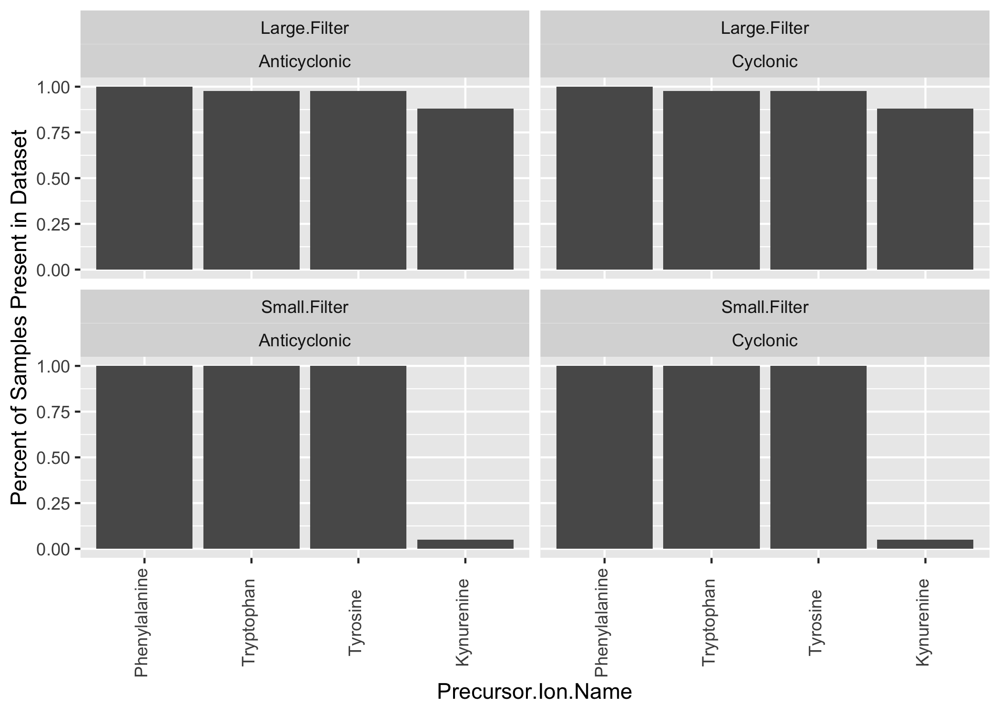
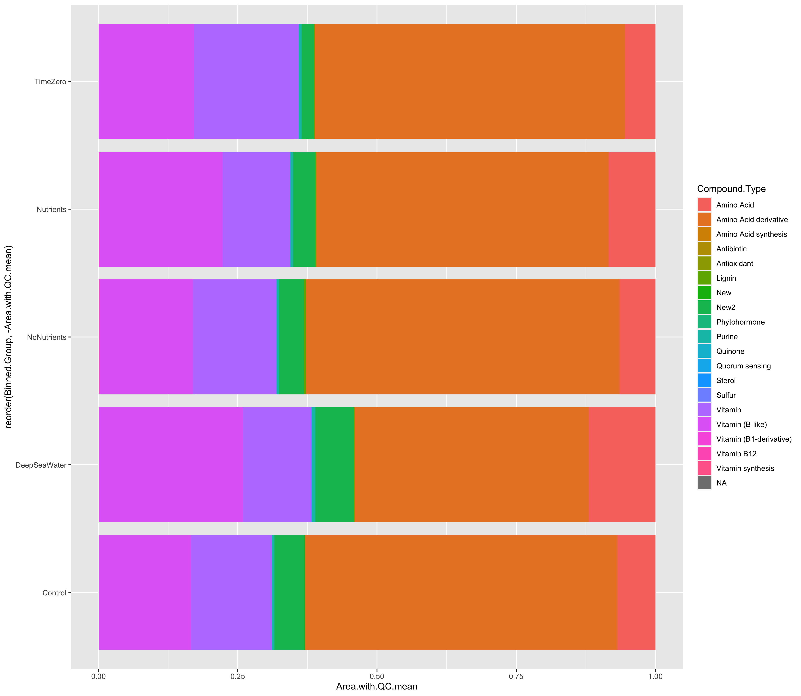
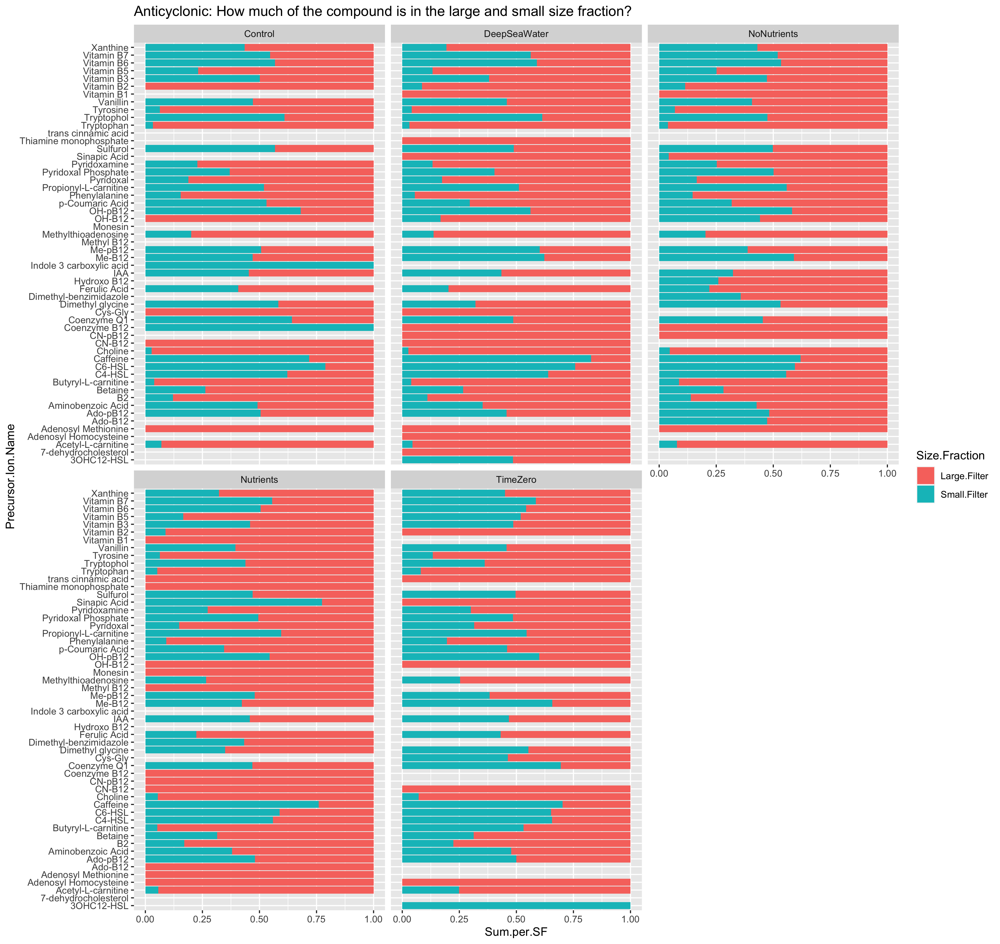

```{r setup, include=FALSE}
library(knitr)
knitr::opts_chunk$set(echo = TRUE)
```

### This is a summary of the ongoing analysis of the MESOSCOPE 
MESOSCOPE B12 Cyano Vitamins, combined with overall Cyano MESOSCOPE project.
The Vitamins dataset is a QE Skyline Cyano run, while the larger MESOSCOPE Cyano sets are 
MSDial QE. 

---

#### QE + TQS QC parameters

The below QC conditions are modified to reflect the Vitamins run. Lower area and height min.

* **area.min   <- 1500 # HILIC - 1000, Cyano - 5000**
* RT.flex    <- 0.2 # HILIC +/- 0.4 min, Cyano +/- 0.2 min
* blk.thresh <- 0.2 # HILIC +/- 0.3, Cyano +/- 0.2
* SN.min     <- 4 # HILIC - 4, Cyano - 4
* height.max <- 1.0e8
* height.min <- 1000

These QC conditions are for the rest of the Cyano run, and reflect ordinary QC levels. 

* **area.min   <- 5000 # HILIC - 1000, Cyano - 5000**
* RT.flex    <- 0.2 # HILIC +/- 0.4 min, Cyano +/- 0.2 min
* blk.thresh <- 0.2 # HILIC +/- 0.3, Cyano +/- 0.2
* SN.min     <- 4 # HILIC - 4, Cyano - 4
* height.max <- 1.0e8
* height.min <- 1000

---

#### Combine all relevant datasets (Vitamins 5000, Full Cyano B12 Incubations set)

```{r sample table, echo=FALSE}
CompleteDataset <- read.csv("data_processed/Vitamins_Incubations_CompleteDataset.csv")
kable(CompleteDataset[1:10, ], caption = "Sample of Combined Dataset")
```

#### Calculate triplicate averages. 
Remove DMB and B2-IS from the averages calculations in the Vitamins set (to avoid inflated values from added DMB)
```{r average table, echo=FALSE}
CompleteDatasetAvg <- read.csv("data_processed/Vitamins_Incubations_AvgCompleteDataset.csv")
kable(CompleteDatasetAvg[1:15, ], caption = "Sample of Averaged Dataset")
```

---

## Which compounds exist in which size fraction?
How many of the samples show up in each size fraction? What is the quality distribution of what exists where?


See which compounds have 100% of the samples present, versus those that have no samples present.
Remember that this is after QC, but before averaging and DMB/B2-IS removal.

```{r Which Compounds table, echo=FALSE}
WhichCompoundsTableCyc <- read.csv("data_intermediate/WhichCompoundsSizeFraction_Cyclonic.csv")
kable(WhichCompoundsTableCyc, caption = "Compounds In Only One Size Fraction, Cyclonic")

WhichCompoundsTableAntiCyc <- read.csv("data_intermediate/WhichCompoundsSizeFraction_Anticyclonic.csv")
kable(WhichCompoundsTableAntiCyc, caption = "Compounds In Only One Size Fraction, Anticyclonic")
```

## Do Nutrients Change with Treatments and Size Fractions?


## Do Compound Proportions Remain Constant with DeepSeaWater?

I am finding it challenging to visualize this with the amount of compounds we are working with. Can we slim down the amount? Arrange the proportions numerically rather than alphabetically? This image is impossible to get anything from, so I filtered for only two abundant compounds (Betaine and Choline) to demonstrate what some proportions may look like.


---

## How much of all the compound is in each size fraction?



